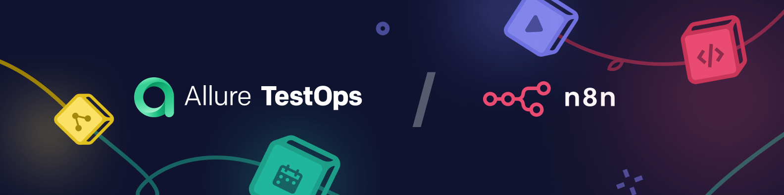

# n8n-nodes-allure-testops

This is an n8n community node. It lets you use [Allure TestOps](https://qameta.io/) in your n8n workflows.

[Allure TestOps](https://qameta.io/) is a test management platform that integrates the processes of test case development, execution, and result analysis into a single system, providing transparency and control throughout all testing phases. It enables teams to centrally track quality metrics, automate reporting through integration with [Allure Framework](https://github.com/allure-framework), and accelerate decision-making via data visualization and collaboration tools.

[n8n](https://n8n.io/) is a [fair-code licensed](https://docs.n8n.io/reference/license/) workflow automation platform.

## Table of contents
- [Installation](#installation)  
- [Operations](#operations)  
- [Credentials](#credentials)  <!-- delete if no auth needed -->  
- [Compatibility](#compatibility)  
- [Usage](#usage)  <!-- delete if not using this section -->  
- [Resources](#resources)  
- [Version history](#version-history)  <!-- delete if not using this section -->
- [License](#license)
- [Contributors](#contributors)

## Installation

Follow the [installation guide](https://docs.n8n.io/integrations/community-nodes/installation/) in the n8n community nodes documentation.

## Operations

_List the operations supported by your node._

## Credentials

_If users need to authenticate with the app/service, provide details here. You should include prerequisites (such as signing up with the service), available authentication methods, and how to set them up._

## Compatibility

_State the minimum n8n version, as well as which versions you test against. You can also include any known version incompatibility issues._

## Usage

_This is an optional section. Use it to help users with any difficult or confusing aspects of the node._

_By the time users are looking for community nodes, they probably already know n8n basics. But if you expect new users, you can link to the [Try it out](https://docs.n8n.io/try-it-out/) documentation to help them get started._

## Resources

* [n8n community nodes documentation](https://docs.n8n.io/integrations/#community-nodes)
* [Allure TestOps](https://docs.qameta.io/allure-testops)

## Version history

_This is another optional section. If your node has multiple versions, include a short description of available versions and what changed, as well as any compatibility impact._

## License
- [Source code](./LICENSE)
- [N8N](./LICENSE.md)
- [Allure TestOps](https://qameta.io/license-terms/)

## Contributors
](https://contrib.rocks/image?repo=GAKiknadze/n8n-nodes-allure-testops)
